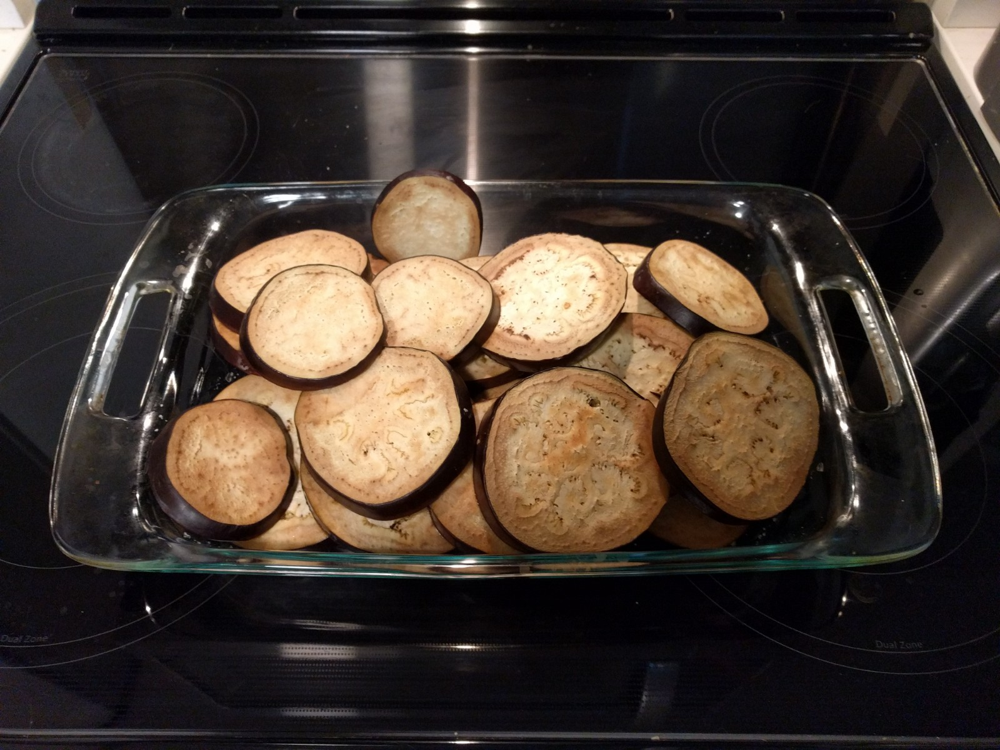
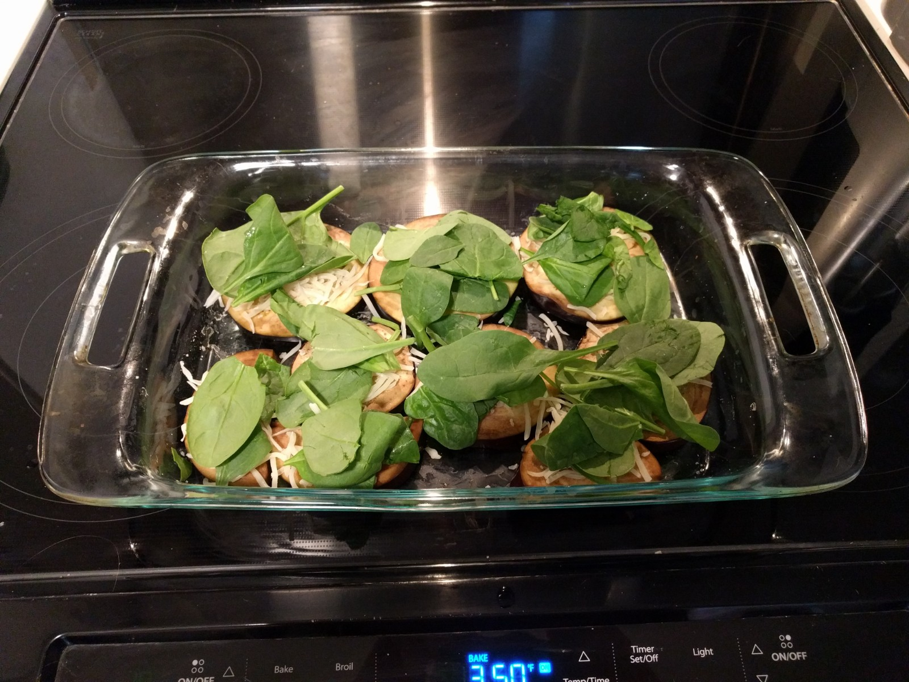

Bacon Spinach Eggplant Stacks
=============================

## Ingredients

2 eggplants

1 jar pasta sauce

3 strips thick cut bacon

1 cup spinach

1/2 cup moz cheese

1/4 cup parmesan cheese

## Steps

1. Wash the eggplants and cut them into 0.5in slices. Optionally peel the
eggplant.

2. Liberally salt the eggplant and set aside for 60 minutes.

+60 minutes

3. Preheat the oven to 350.

4. Thoroughly wash the eggplant in a colander.

5. Place the eggplant in a 9x12 baking pan, and bake in the oven for 30
minutes.

+30 minutes

6. Remove eggplant from the oven and place to the side to cool.

7. Cut the bacon into small pieces (about 0.25in).

8. Create the eggplant stacks in layers. The bottom layer is eggplant,
followed by a layer of spinach and mozzarella cheese. Repeat these layers
until you are out of eggplant.

9. Cover the stacks of eggplant with pasta sauce.

10. Finish the stacks by adding parmesan cheese and bacon.

11. Bake at 350 for 50 minutes.

+50 minutes

12. Remove from the oven and let sit before eating.
